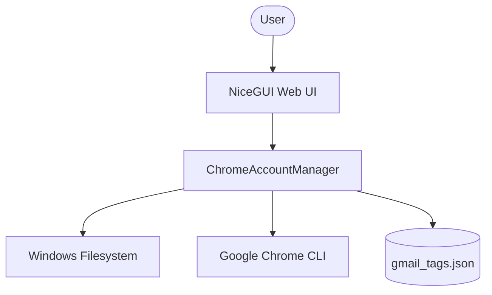

# Project Structure - Gmail Extractor Pro

## Architecture Overview
The application follows a clean Separation of Concerns (SoC) pattern:

- **Frontend (NiceGUI)**: Handles rendering, user interactions, and state management using Quasar components and a custom Dark Premium theme.
- **Logic Layer (logic.py)**: Encapsulates Chrome profile scanning, email extraction from `Preferences` files, and local persistence.
- **External Integration**: Interacts directly with the Windows filesystem (`%LOCALAPPDATA%`) and uses subprocesses to launch Chrome.

## File Map
- `main_app.py`: The entry point and UI definition.
- `logic.py`: Core `ChromeAccountManager` class.
- `gmail_tags.json`: Local database for account platform tags.
- `requirements.txt`: Python dependency list.

## System Diagram

